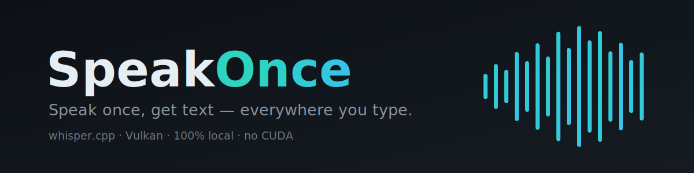

# SpeakOnce

**Speak once, get text — everywhere you type.**

SpeakOnce is a self-hosted, GPU-accelerated voice dictation tool for Linux. Press a hotkey, talk, press it again, and your words are transcribed locally and typed straight into whatever app has focus. No cloud, no CUDA, no subscription — the audio never leaves your machine.

It's the dictation half of a pair with [TypeOnce](https://github.com/goweft/TypeOnce): *type once* for boilerplate you trigger, *speak once* for prose you dictate.

## Why

Cloud dictation tools are polished, but they're subscriptions that stream your microphone — and sometimes a screenshot of everything around it — to someone else's servers. And almost every "local Whisper" guide assumes an NVIDIA GPU.

SpeakOnce is the opposite of all that:

- **Local.** Your voice goes mic → GPU → cursor. Nothing is uploaded, stored, or trained on.
- **Free.** You own the hardware; there's no plan to pay for.
- **AMD-friendly.** It runs Whisper on the **Vulkan** backend, so it works on AMD/RDNA cards (and anything with a Vulkan driver) with *no ROCm or CUDA toolchain to wrestle.*
- **Fast.** On a modern GPU a sentence transcribes in well under a second.

## Features

- Toggle-to-talk dictation that types into any X11 app via `xdotool`
- GPU transcription through [whisper.cpp](https://github.com/ggml-org/whisper.cpp) on Vulkan
- Optional **cleanup mode** — pipes the transcript through a local [Ollama](https://ollama.com) model to fix grammar, punctuation, and filler words
- **Vocabulary packs** — drop-in term lists that bias Whisper toward your jargon (AI, MCP, project names) so a small model stops mishearing them
- One-command installer that builds Whisper, fetches a model, and binds the hotkeys

## How it works

```
mic -> parecord (16kHz) -> whisper.cpp (Vulkan/GPU) -> [optional Ollama cleanup] -> xdotool types it
```

Press the hotkey once to start recording from your default input; press it again to stop, transcribe on the GPU, and type the result at the cursor. The whole loop is local.

Two modes:
- **Raw** (`speakonce`) — verbatim transcription, fastest.
- **Clean** (`speakonce clean`) — runs the transcript through a small local LLM first for grammar/punctuation/filler cleanup. Adds ~0.3s once the model is warm.

## Requirements

- Linux with an X11 session (tested on Ubuntu 24.04 + XFCE)
- A GPU with a Vulkan driver (AMD RADV, NVIDIA, or Intel) — falls back to CPU otherwise
- A microphone
- For cleanup mode: [Ollama](https://ollama.com) with a small **non-reasoning** instruct model (`qwen2.5-coder:7b`, `llama3.2:3b`). Reasoning models (qwen3, deepseek-r1) ramble — avoid them here.

## Install

```bash
git clone https://github.com/goweft/SpeakOnce
cd SpeakOnce
./setup.sh
```

The installer pulls the system packages, builds whisper.cpp with Vulkan, downloads the `small.en` model, installs the scripts to `~/.local/bin`, copies the vocabulary packs to `~/.config/speakonce/packs`, and (on XFCE) binds **F9** = raw and **F10** = clean.

## Usage

1. Click into any text field.
2. Press **F9** — recording starts (you'll see a notification).
3. Speak.
4. Press **F9** again — it transcribes and types at your cursor.

Use **F10** for the cleaned-up version. Same key starts and stops; it's a toggle.

> On a remote desktop (NoMachine, RDP, VNC) the Windows/Super key is usually captured by your *local* OS, so SpeakOnce binds plain function keys, which pass through. Rebind in your DE's keyboard settings if F9/F10 collide with something.

## Configuration

Everything is env-overridable:

| Variable | Default | Purpose |
| --- | --- | --- |
| `SPEAKONCE_MODEL` | `~/whisper.cpp/models/ggml-small.en.bin` | Whisper model to use |
| `SPEAKONCE_DEVICE` | *(system default)* | PulseAudio source to record from |
| `SPEAKONCE_PACKS` | `~/.config/speakonce/packs` | directory of vocabulary packs |
| `SPEAKONCE_CLEAN_MODEL` | `qwen2.5-coder:7b` | Ollama model for cleanup mode |
| `SPEAKONCE_OLLAMA_URL` | `http://localhost:11434` | Ollama endpoint |

Find your mic's source name with `pactl list sources short`, then set `SPEAKONCE_DEVICE` to pin it.

Want higher accuracy? Swap in `medium.en`:

```bash
( cd ~/whisper.cpp && bash ./models/download-ggml-model.sh medium.en )
export SPEAKONCE_MODEL=~/whisper.cpp/models/ggml-medium.en.bin
```

### Vocabulary packs

A pack is just a `.txt` file of terms in `~/.config/speakonce/packs/`. SpeakOnce concatenates them all into Whisper's initial prompt, biasing recognition toward those words. It ships with `core.txt` (general AI/dev/self-hosting terms); add your own (`packs/mywork.txt`) for project names and jargon. Keep the total under ~200 tokens — Whisper truncates beyond that.

## Related

- [TypeOnce](https://github.com/goweft/TypeOnce) — the sibling project: a self-hosted text-expansion engine. Type a short trigger, get the full boilerplate. Same philosophy, different input method.

## License

MIT — see [LICENSE](LICENSE).
